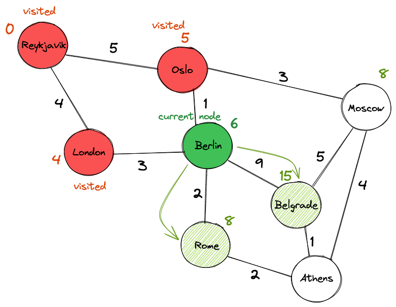

# Travel Order Resolver

## Description

A school project whose objective is to create an AI that determines the fastest train route when dictated by voice. The message is transcribed from spoken to written and then analyzed via natural language processing tools to determine a route.

## Technologies used

### Speach recognition

<https://pypi.org/project/SpeechRecognition/>

### Natural Language Processing

- Multinomial NB
- Count Vectorizer
- Tfidf Transformer
- Spacy

### Pathfinder

Dijkstra’s Algorithm.  
<https://www.udacity.com/blog/2021/10/implementing-dijkstras-algorithm-in-python.html>

  

## Install dependencies

### On Linux

`sudo apt-get install python-pyaudio python3-pyaudio`

`pip install SpeechRecognition`

### On MacOS (M1)

`brew install portaudio`

`pip install pyaudio`

`brew install flac`

`pip install SpeechRecognition`

### On Windows

`pip install pyaudio`

`pip install SpeechRecognition`
